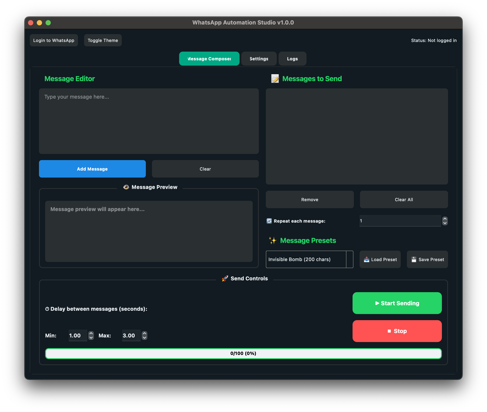
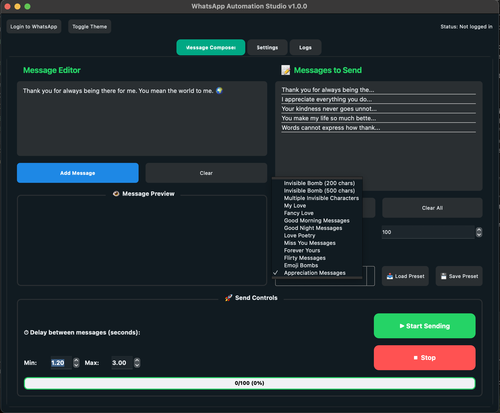
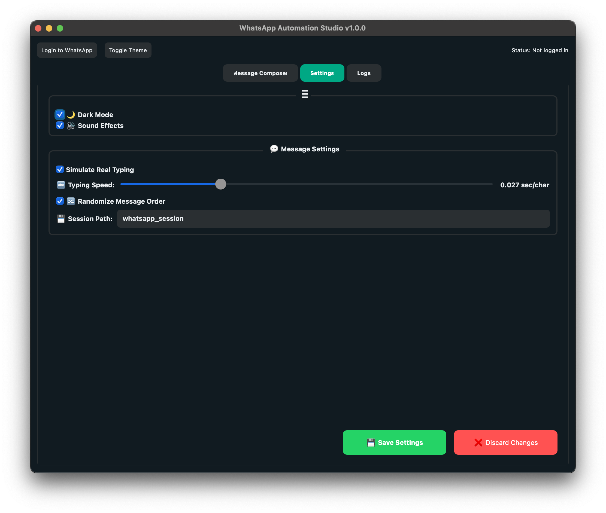
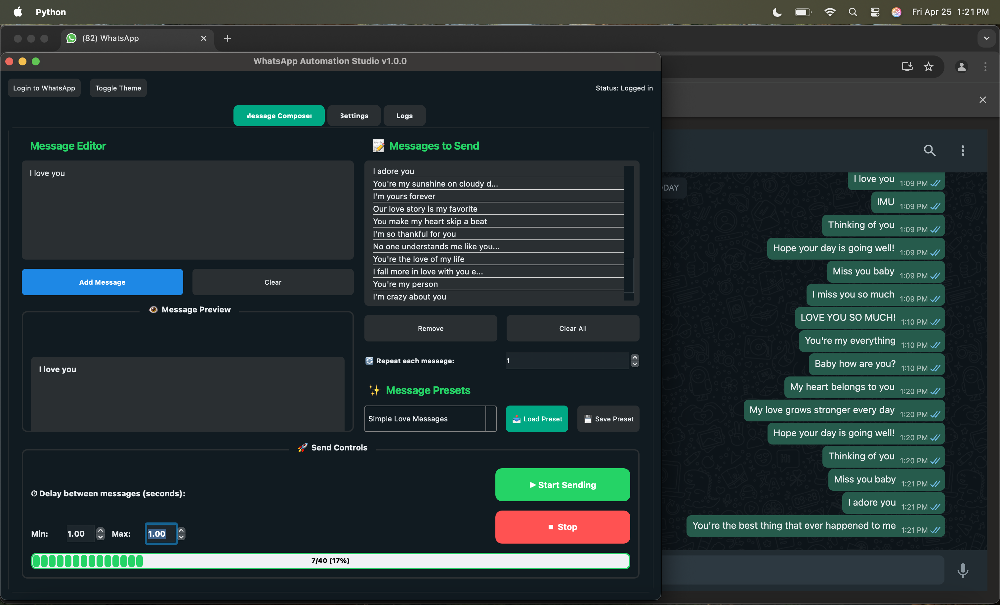
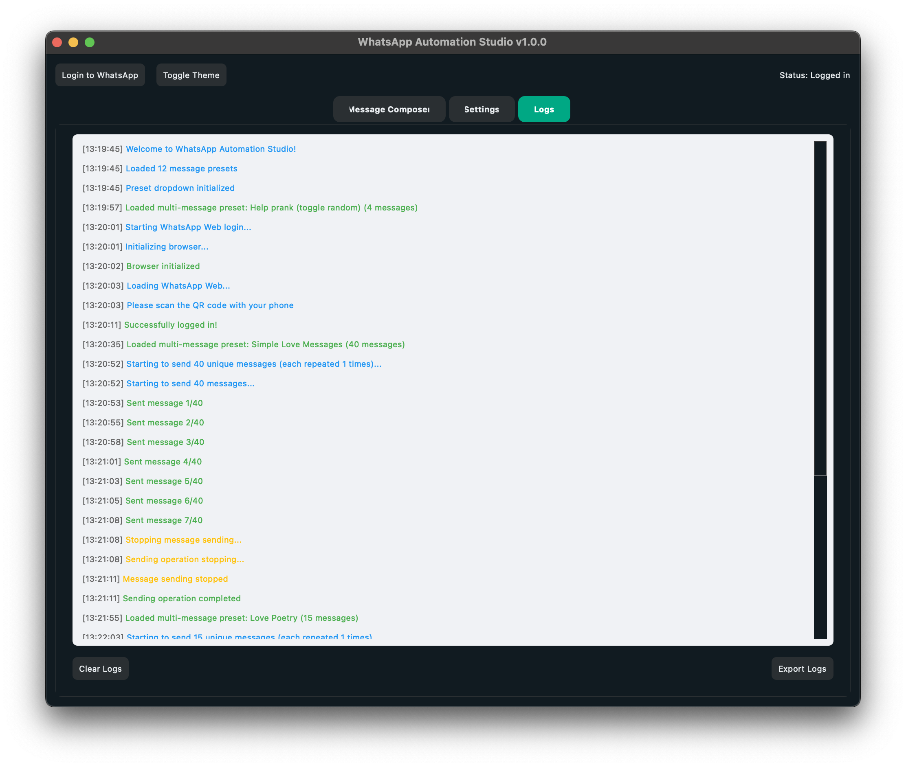

<div align="center">
  
  <h1>WhatsApp Automation Studio</h1>
  <p><strong>Professional WhatsApp Web automation for seamless messaging</strong></p>
  
  [](https://creativecommons.org/licenses/by-nc/4.0/)
  
  
</div>

> 🚀 **Effortlessly automate WhatsApp Web messaging with this powerful Python tool!** Send multiple messages, use presets, simulate human typing, customize delays, and more—all through an elegant GUI. Perfect for sending reminders, greetings, or bulk messages while maintaining natural communication patterns.

<hr>

## 🚀 Automate WhatsApp Web Messaging

**WhatsApp Automation Studio** provides an intuitive interface for automating message sending through WhatsApp Web. Designed with user experience in mind, this desktop application helps you save time and effort when communicating with contacts.

<div align="center">
  
  <p><em>Clean and intuitive dashboard for managing all your automation needs</em></p>
</div>

## ✨ Key Features

- **Multiple Message Queue** - Create and send a sequence of messages automatically
- **Pre-built Message Templates** - Access a library of ready-to-use message collections
- **Human-like Typing Simulation** - Messages appear naturally typed with realistic pauses
- **Customizable Timing** - Set precise intervals between messages for authenticity
- **Message Randomization** - Optional shuffling for more natural conversation patterns
- **Appearance Options** - Toggle between dark and light modes for your comfort
- **Interactive Message Editor** - Real-time preview of your message formatting
- **Message Repeat Controls** - Specify how many times each message should be sent

<div class="feature-showcase" align="center">
  
  <p><em>Powerful message composer with preset management capabilities</em></p>
</div>

## 🛠️ Installation & Setup

### Prerequisites
- Python 3.8 or higher
- Google Chrome browser
- Active WhatsApp account

### Quick Start

```bash
# Clone the repository
git clone https://github.com/yourusername/WhatsApp-Messages-Automation.git

# Navigate to the project directory
cd WhatsApp-Messages-Automation

# Install dependencies
pip install -r requirements.txt

# Launch the application
python whatsapp_msg_automation.py
```

## 📚 How to Use

<div align="center">
  
  <p><em>The settings panel with customizable options</em></p>
</div>

1. **Initial Setup**
   - Launch the application and complete the one-time WhatsApp Web login
   - Follow the guided onboarding tutorial for first-time users
   - Configure your preferred settings for message timing and behavior

2. **Creating Messages**
   - Compose messages in the rich text editor with live preview
   - Add multiple messages to your send queue in any order
   - Set individual repeat counts for each message as needed

3. **Using Message Presets**
   - Choose from various built-in message collections for different scenarios
   - Save your own frequently used messages as custom presets
   - Load entire message sets with a single click for rapid setup

4. **Sending Messages**
   - Log in to WhatsApp Web through the app
   - Select a chat in WhatsApp Web
   - Click "Start Sending" to begin the automation
   - Monitor progress through the logs tab

## 🔧 Advanced Configuration

<div align="center">
  <table>
    <thead>
      <tr>
        <th align="center">⚙️ Feature</th>
        <th align="center">📝 Description</th>
        <th align="center">🔄 Default</th>
      </tr>
    </thead>
    <tbody>
      <tr>
        <td align="center"><b>⌨️ Typing Speed</b></td>
        <td>Control character-by-character typing simulation speed</td>
        <td align="center"><code>0.01 sec/char</code></td>
      </tr>
      <tr>
        <td align="center"><b>⏱️ Delay Range</b></td>
        <td>Set minimum and maximum wait time between messages</td>
        <td align="center"><code>1-3 seconds</code></td>
      </tr>
      <tr>
        <td align="center"><b>👆 Typing Simulation</b></td>
        <td>Enable/disable realistic human-like typing animation</td>
        <td align="center"><code>Enabled</code></td>
      </tr>
      <tr>
        <td align="center"><b>🔀 Randomize Order</b></td>
        <td>Shuffle the sequence of queued messages for natural feel</td>
        <td align="center"><code>Disabled</code></td>
      </tr>
      <tr>
        <td align="center"><b>🔊 Sound Effects</b></td>
        <td>Enable/disable sound effects for message sending and typing simulation</td>
        <td align="center"><code>Enabled</code></td>
      </tr>
      <tr>
        <td align="center"><b>💾 Session Path</b></td>
        <td>Specify custom storage location for WhatsApp Web session data</td>
        <td align="center"><code>User home folder</code></td>
      </tr>
    </tbody>
  </table>
</div>

## 📸 Gallery

<div align="center">
  <p><b>See WhatsApp Automation Studio in action!</b></p>
  
  
  <p><i>Demonstration of the invisible message prank feature in action</i></p>
  
  
  <p><i>Automated love messages being delivered with natural timing intervals</i></p>
  
  
  <p><i>Poetry messages being sent through the human-like typing simulation</i></p>

  
  <p><i>Real-time activity logging panel showing message delivery status</i></p>
</div>

## ❓ Frequently Asked Questions

<details>
  <summary><b>📱 How should I use this tool?</b></summary>
  <p>WhatsApp Automation Studio enhances your personal messaging experience. Use it responsibly and thoughtfully.</p>
</details>

<p><b>⚠️ Warning:</b> Use this tool responsibly and adhere to WhatsApp's policies to avoid account restrictions.</p>

<details>
  <summary><b>Can recipients tell I'm using automation?</b></summary>
  <p>With typing simulation enabled and reasonable delays between messages, the experience appears very natural. The application is designed to mimic human messaging patterns.</p>
</details>

<details>
  <summary><b>What happens if my internet disconnects?</b></summary>
  <p>The application will detect the disconnect and pause the automation. You can resume once connectivity is restored.</p>
</details>

<details>
  <summary><b>Can I schedule messages for later?</b></summary>
  <p>The current version doesn't include scheduling functionality, but it's on our roadmap for future updates.</p>
</details>

## 📋 License

<div align="center">
  
  <p>This project is licensed under the <b>Creative Commons Attribution-NonCommercial 4.0 International License</b></p>
</div>

<table>
  <tr>
    <td align="center" width="33%">✅ <b>Permitted</b></td>
    <td align="center" width="33%">❌ <b>Prohibited</b></td>
    <td align="center" width="33%">⚠️ <b>Required</b></td>
  </tr>
  <tr>
    <td>
      • Use for personal projects<br>
      • Modify the code<br>
      • Share with friends<br>
      • Create adaptations
    </td>
    <td>
      • Commercial use<br>
      • Selling the software<br>
      • Using in a business context<br>
      • Removing attributions
    </td>
    <td>
      • Attribution to creator<br>
      • Include copyright notice<br>
      • State changes made<br>
      • Include license link
    </td>
  </tr>
</table>

<p align="center">For full license details, see the <a href="LICENSE">LICENSE</a> file.</p>

## 🤝 Support & Contribution

For support requests, feature suggestions, or bug reports, please open an issue on the GitHub repository. Contributions are welcome through pull requests after discussing proposed changes.

---

<div align="center">
  <p>
    <strong>WhatsApp Automation Studio</strong> — Developed with ❤️ by SohanRaidev<br>
    <small>© 2025 All Rights Reserved</small>
  </p>
  
</div>

